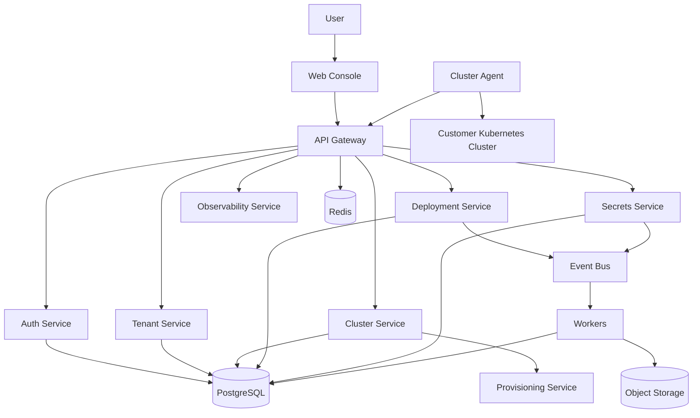
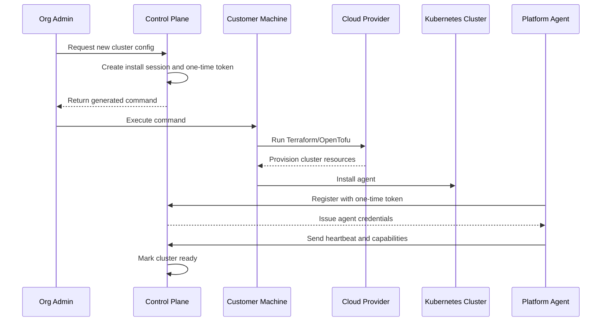
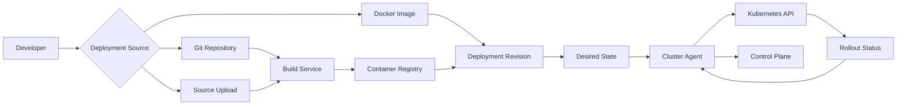

# 02 — System Architecture

## 1. Architectural Planes

The platform is organized into three planes.

### Control Plane (hosted by the platform)
- Owns identity, tenancy, projects, cluster inventory, deployment metadata, policy, audit, billing, and public APIs.
- Generates install bundles and registration tokens.
- Does not require permanent customer cloud credentials.
- Communicates with in-cluster agents over **outbound** connections initiated by the customer cluster.

### Customer Execution Plane (runs on the customer machine during install)
- Executes generated Terraform/OpenTofu.
- Provisions cloud networking, IAM, the Kubernetes cluster, node pools, ingress dependencies, and the platform agent.
- Registers the cluster back to the control plane using a short-lived one-time token.

### Cluster Data Plane (runs inside each customer Kubernetes cluster)
- Hosts the platform agent, deployment reconciler, log shipper, metrics collector, ingress/TLS integrations, and optional build runner.
- Pulls desired state from the control plane and reports actual state back.

## 2. Control-Plane Services

| Service | Responsibility |
|---|---|
| API Gateway | Ingress, auth enforcement, routing, rate limiting, tenant context injection |
| Auth Service | Identity, sessions, tokens, SSO/MFA, agent credential exchange |
| Tenant Service | Organizations, projects, memberships, RBAC |
| Cluster Service | Cluster inventory, registration lifecycle, agent health |
| Provisioning Service | Generate cluster config + install command, track install sessions |
| Deployment Service | App specs, releases, rollout, rollback, desired-state authority |
| Build Service | Build images from Git/upload, push to registry |
| Secrets Service | Envelope-encrypted secrets, versions, scoped sync |
| Domain Service | Domains, verification, ingress bindings, TLS lifecycle |
| Observability Service | Log/metric ingest and query, health summaries |
| Notification Service | Email/webhook/Slack/in-app delivery |
| Audit Service | Immutable record of all state-changing actions |

## 3. Supporting Infrastructure

- **PostgreSQL** — transactional state (per-service logical schemas).
- **Redis** — cache, rate-limit counters, distributed locks, token denylist.
- **Message broker** (Kafka/NATS) — asynchronous event propagation.
- **Object storage** — install bundles, source uploads, build cache, audit cold storage.
- **Container registry** — built images.
- **Time-series/log backend** — Prometheus/Mimir (metrics), Loki/Elasticsearch (logs).

## 4. Component Diagram

## 5. New Cluster Creation Flow

## 6. Application Deployment Flow

## 7. Communication Patterns

- **Synchronous (HTTP/gRPC):** user-facing control flow through the gateway; agent → control-plane pull of desired state.
- **Asynchronous (events):** state propagation between services via the broker using the transactional outbox pattern; idempotent consumers.
- **Pull-based agents:** customer clusters open only outbound connections; the control plane never connects inbound.

## 8. Cross-Cutting Concerns

- **Observability:** OpenTelemetry tracing across services; structured logs; RED/USE metrics.
- **Resilience:** retries with backoff, circuit breakers on cross-service calls, idempotency keys.
- **Configuration:** per-environment values via GitOps; secrets via KMS-backed store.
- **Tenancy:** `org_id` flows through context from gateway to DB and is enforced at every layer.
