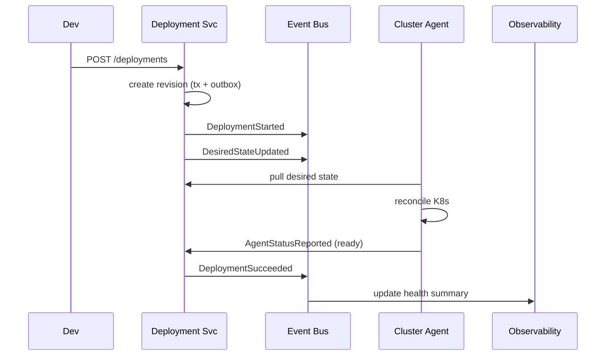

# 03 — Engineering Design Specification

This document is the implementation-ready specification covering system decomposition, repository design, service implementation order, event architecture, Kubernetes design, and engineering tickets.

---

## PART 1 — System Decomposition

Each service is independently deployable, owns its own schema (logical or physical), and communicates through synchronous APIs (control flow) and asynchronous events (state propagation).

### 1.1 API Gateway
- **Purpose:** Single ingress for all external traffic.
- **Responsibilities:** TLS termination, JWT/session validation, tenant context injection, routing, rate limiting, request logging, API versioning, WebSocket proxying for log streaming.
- **API ownership:** Gateway-level routes only (`/healthz`, `/version`).
- **Database ownership:** None. Redis for rate-limit counters and token denylist.
- **Events produced:** `RequestRejected` (sampled), `GatewayHealthChanged`.
- **Events consumed:** `TokenRevoked`.
- **Dependencies:** Auth Service, Redis, all backend services.
- **Scaling:** Stateless, 3+ replicas, scale on RPS/p99 latency.

### 1.2 Auth Service
- **Purpose:** Identity, authentication, token issuance, machine identities.
- **Responsibilities:** Email/password, OIDC/SAML SSO, MFA, refresh/access tokens, API tokens, service accounts, agent credential exchange, revocation.
- **API ownership:** `/auth/*`, `/tokens/*`, `/service-accounts/*`.
- **Database ownership:** `users`, `credentials`, `sessions`, `api_tokens`, `service_accounts`, `mfa_factors`, `oauth_identities`.
- **Events produced:** `UserRegistered`, `UserLoggedIn`, `LoginFailed`, `TokenRevoked`, `MFAEnabled`, `AgentCredentialIssued`.
- **Events consumed:** `OrganizationCreated`, `MemberInvited`.
- **Dependencies:** Tenant Service, Notification Service, Redis.
- **Scaling:** Stateless; restricted network segment.

### 1.3 Tenant Service
- **Purpose:** Organizations, projects, memberships, RBAC source of truth.
- **Responsibilities:** Org/project CRUD, invitations, role assignment, permission resolution, plan/quota metadata.
- **API ownership:** `/organizations/*`, `/projects/*`, `/members/*`, `/roles/*`, `/invitations/*`.
- **Database ownership:** `organizations`, `organization_members`, `projects`, `project_members`, `roles`, `invitations`, `quotas`.
- **Events produced:** `OrganizationCreated`, `ProjectCreated`, `MemberInvited`, `MemberJoined`, `RoleChanged`, `MemberRemoved`.
- **Events consumed:** `UserRegistered`.
- **Dependencies:** Auth, Notification, Audit.
- **Scaling:** Stateless, read-heavy; cache permission lookups in Redis.

### 1.4 Cluster Service
- **Purpose:** Cluster inventory and lifecycle.
- **Responsibilities:** Cluster records, registration sessions, agent registration/heartbeat, capability tracking, environment/namespace assignment, health rollup.
- **API ownership:** `/clusters/*`, `/clusters/{id}/agents/*`, `/clusters/{id}/heartbeat`, `/clusters/{id}/assignments`.
- **Database ownership:** `clusters`, `cluster_environments`, `cluster_install_sessions`, `cluster_agents`, `cluster_capabilities`.
- **Events produced:** `ClusterRegistrationRequested`, `ClusterRegistered`, `ClusterReady`, `ClusterUnhealthy`, `ClusterDeleted`, `AgentHeartbeatMissed`.
- **Events consumed:** `ClusterProvisioningSucceeded`, `DeploymentScheduled`.
- **Dependencies:** Auth (agent credential exchange), Provisioning, Audit.
- **Scaling:** Stateless API; heartbeat ingestion buffered to Redis before DB flush.

### 1.5 Provisioning Service
- **Purpose:** Generate cloud-specific cluster config and install commands; track install sessions.
- **Responsibilities:** Render Terraform/OpenTofu variables, backend config, module versions; generate one-time install command; track session state; ingest provisioning telemetry.
- **API ownership:** `/clusters/provision`, `/install-sessions/*`, `/provisioning/templates/*`.
- **Database ownership:** `provisioning_templates`, `install_bundles`, `provisioning_runs`.
- **Events produced:** `ClusterProvisioningRequested`, `InstallBundleGenerated`, `ClusterProvisioningStarted`, `ClusterProvisioningSucceeded`, `ClusterProvisioningFailed`.
- **Events consumed:** `ClusterRegistrationRequested`, `AgentCredentialIssued`.
- **Dependencies:** Cluster, Auth, Object Storage, Audit.
- **Scaling:** Stateless rendering; low/bursty RPS.

### 1.6 Deployment Service
- **Purpose:** Application specs, releases, rollout orchestration, desired-state authority.
- **Responsibilities:** App/environment CRUD, immutable deployment revisions, rollout orchestration, rollback, desired-state computation, reconcile contract with agents.
- **API ownership:** `/applications/*`, `/applications/{id}/environments/*`, `/deployments/*`, `/deployments/{id}/rollback`, `/desired-state/*` (agent-facing).
- **Database ownership:** `applications`, `application_environments`, `deployments`, `deployment_revisions`, `rollout_status`.
- **Events produced:** `DeploymentCreated`, `DeploymentStarted`, `BuildRequested`, `DeploymentSucceeded`, `DeploymentFailed`, `DeploymentRolledBack`.
- **Events consumed:** `BuildSucceeded`, `BuildFailed`, `AgentStatusReported`, `SecretUpdated`.
- **Dependencies:** Build, Cluster, Secrets, Cluster Agent.
- **Scaling:** Stateless API + worker pool for rollout state machines; scale workers on queue depth.

### 1.7 Build Service
- **Purpose:** Build container images from Git or uploaded source.
- **Responsibilities:** Source fetch, build orchestration (Kaniko/BuildKit), registry push, build logs, cache, SBOM/provenance, per-tenant isolation.
- **API ownership:** `/builds/*`, `/builds/{id}/logs`, `/source-uploads/*`.
- **Database ownership:** `builds`, `build_steps`, `build_artifacts`, `source_uploads`.
- **Events produced:** `BuildQueued`, `BuildStarted`, `BuildSucceeded`, `BuildFailed`, `ImagePushed`.
- **Events consumed:** `BuildRequested`.
- **Dependencies:** Object Storage, Container Registry, Secrets, broker.
- **Scaling:** Control component stateless; build executors ephemeral; per-tenant concurrency limits.

### 1.8 Secrets Service
- **Purpose:** Encrypted secret storage and scoped sync to clusters.
- **Responsibilities:** Envelope encryption (KMS), versioning, bindings, scoped sync instructions, access policy, access-metadata audit.
- **API ownership:** `/secrets/*`, `/secret-bindings/*`, `/secrets/{id}/versions/*`.
- **Database ownership:** `secrets`, `secret_versions`, `secret_bindings`, `kms_keys`.
- **Events produced:** `SecretCreated`, `SecretUpdated`, `SecretRotated`, `SecretBound`, `SecretSyncRequested`, `SecretDeleted`.
- **Events consumed:** `ApplicationEnvironmentCreated`, `ClusterReady`.
- **Dependencies:** KMS, Cluster Agent, Audit.
- **Scaling:** Stateless; restricted segment; strict audit.

### 1.9 Domain Service
- **Purpose:** Custom domains, verification, ingress bindings, TLS lifecycle.
- **Responsibilities:** Domain registration, DNS verification, domain→app bindings, certificate orchestration via cert-manager/cloud issuer, cert status and renewal monitoring.
- **API ownership:** `/domains/*`, `/domains/{id}/verify`, `/domains/{id}/bindings`, `/certificates/*`.
- **Database ownership:** `domains`, `domain_bindings`, `certificates`, `dns_verifications`.
- **Events produced:** `DomainAdded`, `DomainVerified`, `DomainBound`, `CertificateRequested`, `CertificateIssued`, `CertificateExpiring`, `CertificateFailed`.
- **Events consumed:** `DeploymentSucceeded`, `AgentStatusReported`.
- **Dependencies:** Cluster Agent, Audit, external DNS/ACME.
- **Scaling:** Stateless API + cron worker for verification/renewal polling.

### 1.10 Observability Service
- **Purpose:** Logs and metrics metadata ingestion and query.
- **Responsibilities:** Receive log/metric shipments from agents, store metadata pointers, proxy queries, deployment health summaries, retention enforcement.
- **API ownership:** `/applications/{id}/logs`, `/applications/{id}/metrics`, `/deployments/{id}/events`, `/ingest/*` (agent-facing).
- **Database ownership:** `log_streams`, `metric_series_meta`, `health_summaries` (metadata only).
- **Events produced:** `HealthSummaryUpdated`, `AlertTriggered`.
- **Events consumed:** `DeploymentSucceeded`, `DeploymentFailed`, `ClusterUnhealthy`.
- **Dependencies:** Loki/Elasticsearch, Prometheus/Mimir, Object Storage.
- **Scaling:** Separate ingest and query deployments.

### 1.11 Notification Service
- **Purpose:** Deliver notifications via email, webhook, Slack, in-app.
- **Responsibilities:** Channel management, templating, delivery, retries, webhook signing, preferences.
- **API ownership:** `/notifications/*`, `/webhooks/*`, `/notification-preferences/*`.
- **Database ownership:** `notification_channels`, `notification_deliveries`, `webhook_endpoints`, `subscriptions`.
- **Events produced:** `NotificationSent`, `NotificationFailed`, `WebhookDeliveryFailed`.
- **Events consumed:** Broad subscriber (`DeploymentFailed`, `CertificateExpiring`, `MemberInvited`, `ClusterUnhealthy`, ...).
- **Dependencies:** Email provider, broker, external webhooks.
- **Scaling:** Stateless + retry worker pool.

### 1.12 Audit Service
- **Purpose:** Immutable record of all security-relevant and state-changing actions.
- **Responsibilities:** Ingest audit events, append-only storage, tenant-scoped query, export, retention/legal hold.
- **API ownership:** `/audit-logs/*` (read-only), `/audit/ingest` (internal).
- **Database ownership:** `audit_logs` (append-only, partitioned).
- **Events produced:** `AuditExported`.
- **Events consumed:** All `*` events.
- **Dependencies:** Broker, Object Storage, DB.
- **Scaling:** Write-heavy append-only; partition by time + org; read replicas for queries.

### 1.13 Cluster Agent
- **Purpose:** In-cluster reconciler in the customer data plane.
- **Responsibilities:** Outbound-only connection, pull desired state, reconcile K8s resources, sync secrets, configure ingress, ship logs/metrics, report status, self-update.
- **API ownership:** Consumes control-plane agent APIs; exposes no public API.
- **Database ownership:** None server-side; local CRD status/cache.
- **Events produced:** `AgentRegistered`, `AgentHeartbeat`, `AgentStatusReported`, `ReconcileSucceeded`, `ReconcileFailed`, `LogBatchShipped`.
- **Events consumed:** `DesiredStateUpdated`, `SecretSyncRequested`, `IngressConfigUpdated`, `AgentUpgradeRequested`.
- **Dependencies:** Control plane (Deployment, Secrets, Domain, Observability, Auth), Kubernetes API.
- **Scaling:** One deployment per cluster, leader-elected, 2 replicas for HA.

---

## PART 2 — Repository Design (Monorepo)

```text
platform/
├── frontend/      # Web console SPA, design system, generated API client, e2e tests
├── backend/       # All control-plane microservices + shared libs + migrations
├── infra/         # Environment infra: CI/CD, GitOps, broker, DB, observability backends
├── helm/          # Helm charts: control-plane services + customer-installed agent chart
├── terraform/     # Reusable EKS/GKE/AKS modules + templates rendered by Provisioning
├── agents/        # Cluster agent source, CRDs, controllers, installer CLI
├── docs/          # Architecture & engineering docs, ADRs, runbooks, API reference
├── scripts/       # Dev bootstrap, codegen, DB seed, release automation
└── proto/         # Shared event/gRPC schema definitions (codegen source of truth)
```

### Folder Explanations
- **frontend/** — `apps/console` main UI, `packages/ui` design system, `packages/api-client` typed client generated from OpenAPI, `e2e/` Playwright tests.
- **backend/** — `services/<name>` per microservice; `libs/` shared `authz`, `events`, `db`, `telemetry`, `errors`; `migrations/` per-service SQL.
- **infra/** — `environments/{dev,staging,prod}`, `gitops/` (ArgoCD/Flux), `platform-services/` (broker, postgres operator, redis, loki, prometheus), `ci/`.
- **helm/** — `control-plane/` umbrella chart, `charts/<service>`, `agent/` chart for customer clusters, `values/<env>.yaml`.
- **terraform/** — `modules/{eks,gke,aks,networking,agent-bootstrap}`, `templates/` rendered by Provisioning, `examples/`.
- **agents/** — `cluster-agent/` reconciler + controllers, `crds/`, `installer-cli/` binary the generated command runs, `manifests/`.
- **docs/** — `architecture/`, `adr/`, `api/`, `runbooks/`, `onboarding/`.
- **scripts/** — `dev/` local stack up/down, `codegen/`, `db/`, `release/`.
- **proto/** — shared schema definitions for inter-service contracts and event payloads.

---

## PART 3 — Service Implementation Order

Target: MVP launch with existing-cluster registration + Docker image deployment + secrets + logs + domains/TLS.

| Week | Focus | Deliverables |
|---|---|---|
| 1 | Foundation | Monorepo + CI, shared libs, schema/migrations for users/orgs/projects, Auth Service (email/password, tokens), API Gateway routing + auth |
| 2 | Tenancy & RBAC | Tenant Service (org/project CRUD, invitations, roles), RBAC middleware + RLS, Audit Service ingest+query, frontend auth + dashboard shell |
| 3 | Cluster Registration | Cluster Service (records, install sessions, agent register, heartbeat), Auth agent-credential exchange, Cluster Agent v0, Helm agent chart + installer CLI skeleton |
| 4 | Desired State & Deployment Core | Deployment Service (apps, envs, deployments, immutable revisions), desired-state pull API, agent reconcile loop, Docker image deploy end-to-end |
| 5 | Status, Logs, Secrets MVP | Agent status reporting + log shipping, Observability ingest+query (Loki), Secrets Service envelope encryption + scoped sync, frontend deploy/logs UI |
| 6 | Domains, TLS, Hardening, Launch | Domain Service (add/verify/bind + cert-manager), Notification Service (deploy + invite + webhook), e2e tests, security review, load test, **MVP launch** |

**Post-MVP (Weeks 7+):** Provisioning Service + EKS/GKE/AKS modules; Build Service (Git + upload); metrics dashboards + alerting + autoscaling; enterprise (SSO/SAML, customer KMS, advanced RBAC, billing).

---

## PART 4 — Event Architecture

**Transport:** Message broker with topic-per-domain. Producers use the transactional outbox pattern; consumers are idempotent (dedupe on `eventId`). Audit Service subscribes to all topics.

### Envelope
```json
{
  "eventId": "uuid",
  "type": "DeploymentSucceeded",
  "version": 1,
  "orgId": "uuid",
  "occurredAt": "iso8601",
  "actor": { "type": "user|agent|system", "id": "uuid" },
  "resource": { "type": "deployment", "id": "uuid" },
  "payload": {}
}
```

### Catalog

| Event | Producer | Consumers | Payload |
|---|---|---|---|
| `UserRegistered` | Auth | Tenant, Notification, Audit | `{ userId, email }` |
| `OrganizationCreated` | Tenant | Auth, Audit | `{ orgId, ownerId, plan }` |
| `MemberInvited` | Tenant | Notification, Auth, Audit | `{ orgId, email, role, invitationId }` |
| `ClusterRegistrationRequested` | Cluster | Provisioning, Audit | `{ clusterId, provider }` |
| `InstallBundleGenerated` | Provisioning | Cluster, Audit | `{ clusterId, bundleRef, sessionId }` |
| `ClusterCreated` | Cluster | Deployment, Observability, Notification, Audit | `{ clusterId, provider, region }` |
| `ClusterProvisioningSucceeded` | Provisioning | Cluster, Audit | `{ clusterId, runId }` |
| `ClusterProvisioningFailed` | Provisioning | Cluster, Notification, Audit | `{ clusterId, runId, reason }` |
| `AgentRegistered` | Cluster | Secrets, Deployment, Audit | `{ clusterId, agentId, capabilities }` |
| `ClusterReady` | Cluster | Secrets, Deployment, Notification, Audit | `{ clusterId }` |
| `ClusterUnhealthy` | Cluster | Notification, Observability, Audit | `{ clusterId, reason, lastSeenAt }` |
| `BuildRequested` | Deployment | Build, Audit | `{ buildId, source, projectId }` |
| `BuildSucceeded` | Build | Deployment, Audit | `{ buildId, imageRef, sbomRef }` |
| `BuildFailed` | Build | Deployment, Notification, Audit | `{ buildId, reason, logRef }` |
| `DeploymentCreated` | Deployment | Audit | `{ deploymentId, appEnvId, revisionId }` |
| `DeploymentStarted` | Deployment | Observability, Audit | `{ deploymentId, revisionId }` |
| `DesiredStateUpdated` | Deployment | Cluster Agent | `{ clusterEnvId, revisionId }` |
| `DeploymentSucceeded` | Deployment | Domain, Observability, Notification, Audit | `{ deploymentId, revisionId }` |
| `DeploymentFailed` | Deployment | Notification, Observability, Audit | `{ deploymentId, reason }` |
| `DeploymentRolledBack` | Deployment | Notification, Audit | `{ deploymentId, fromRevision, toRevision }` |
| `SecretCreated` | Secrets | Audit | `{ secretId, scope, name }` |
| `SecretUpdated` | Secrets | Deployment, Audit | `{ secretId, version }` |
| `SecretSyncRequested` | Secrets | Cluster Agent, Audit | `{ clusterEnvId, secretRefs }` |
| `DomainVerified` | Domain | Notification, Audit | `{ domainId, hostname }` |
| `CertificateIssued` | Domain | Notification, Audit | `{ domainId, certId, expiresAt }` |
| `CertificateExpiring` | Domain | Notification, Audit | `{ certId, expiresAt }` |
| `AgentStatusReported` | Cluster Agent | Deployment, Observability | `{ clusterId, deploymentId, status, ready, total }` |
| `NotificationSent` | Notification | Audit | `{ channel, target, eventType }` |

### Deployment Flow (async)



---

## PART 5 — Kubernetes Design

See `07-cluster-engine-design.md` and `08-agent-design.md` for full detail. Summary:

- **Namespaces (control plane):** `platform-system`, `platform-data`, `platform-observability`, `platform-ingress`.
- **Namespaces (customer cluster):** `platform-agent`, workload namespaces `proj-{slug}-{env}`.
- **RBAC:** per-service ServiceAccounts least-privilege; agent ClusterRole scoped to `proj-*` namespaces.
- **CRDs:** `PlatformApplication`, `PlatformDeployment`, `PlatformSecretSync`, `PlatformDomain`.
- **Operators:** agent controllers; control-plane Postgres operator, cert-manager, ingress controller.
- **Ingress + TLS:** ingress controller + cert-manager ACME ClusterIssuer.
- **Monitoring:** Prometheus, Loki, Grafana, Alertmanager, OpenTelemetry.

---

## PART 6 — Development Tasks (Epics → Stories → Tasks → Acceptance)

### EPIC 1 — Platform Foundation
**Story 1.1 — Monorepo & CI**
- Tasks: scaffold monorepo (Part 2 layout); build tooling (turbo/go.work); CI lint/test/build per service; container build pipeline.
- Acceptance: `scripts/dev` brings up local stack; CI green on empty services; images publish on main.

**Story 1.2 — Shared Libraries**
- Tasks: `db` (migrations, RLS helpers), `authz` (RBAC + tenant scope middleware), `events` (broker client, outbox, schemas), `telemetry`, `errors` (standard envelope).
- Acceptance: each lib unit-tested; a sample service uses all libs; standard error envelope returned on failure.

### EPIC 2 — Authentication
**Story 2.1 — Email/Password Auth**
- Tasks: user registration, password hashing (argon2), login, access/refresh tokens, refresh rotation, logout/revocation.
- Acceptance: valid login returns tokens; expired/revoked tokens rejected; passwords never logged.

**Story 2.2 — Agent Credential Exchange**
- Tasks: one-time install token validation; exchange for per-cluster agent credential; revocation.
- Acceptance: token usable once; expired token rejected; revoked agent credential denied immediately.

### EPIC 3 — Tenancy & RBAC
**Story 3.1 — Organizations & Projects**
- Tasks: org CRUD, project CRUD, slug uniqueness, ownership bootstrap on org creation.
- Acceptance: creator becomes owner; duplicate slug returns `409 SLUG_TAKEN`.

**Story 3.2 — Members, Roles, Invitations**
- Tasks: invite by email, role assignment, accept invite, permission resolution API, Redis caching.
- Acceptance: only admins invite; roles enforced; cross-tenant access denied and audited.

**Story 3.3 — RLS Backstop**
- Tasks: RLS policies on tenant tables keyed on session var; repository guard rejecting unscoped queries.
- Acceptance: query without org scope fails; cross-org row access blocked at DB.

### EPIC 4 — Cluster Registration
**Story 4.1 — Register Existing Cluster**
- Tasks: cluster record creation, install session + one-time token, generated install command, Helm agent chart.
- Acceptance: command output valid; agent registers; cluster transitions `pending → registered → ready`.

**Story 4.2 — Heartbeat & Health**
- Tasks: heartbeat endpoint, staleness detection, `ClusterUnhealthy` on missed heartbeats, capability reporting.
- Acceptance: missed heartbeats flip status within threshold; capabilities visible in UI.

### EPIC 5 — Deployment Core
**Story 5.1 — Applications & Environments**
- Tasks: app CRUD, environment CRUD bound to cluster environment/namespace.
- Acceptance: env maps to exactly one cluster namespace; project access enforced.

**Story 5.2 — Docker Image Deployment**
- Tasks: deployment create with config schema, immutable revision snapshot, desired-state pull API, agent reconcile.
- Acceptance: deployment reaches `healthy`; revision immutable; invalid source returns `422`.

**Story 5.3 — Rollback**
- Tasks: rollback endpoint, target previous healthy revision.
- Acceptance: rollback creates new revision pointing to prior config; `409` when no previous revision.

### EPIC 6 — Secrets
**Story 6.1 — Encrypted Secrets**
- Tasks: envelope encryption with KMS, versioning, bindings, never return plaintext.
- Acceptance: value never appears in API/logs/events; rotation creates new version.

**Story 6.2 — Scoped Sync**
- Tasks: `SecretSyncRequested` to agent, agent writes K8s Secret in target namespace, access-metadata audit.
- Acceptance: only bound secrets sync to the correct namespace; access audited.

### EPIC 7 — Observability
**Story 7.1 — Logs**
- Tasks: agent log shipping, Observability ingest, query API with cursor pagination, live tail via WebSocket.
- Acceptance: logs queryable within seconds; time-range cap enforced (`422`).

### EPIC 8 — Domains & TLS
**Story 8.1 — Domains & Verification**
- Tasks: domain add, DNS TXT verification, domain→app binding.
- Acceptance: verification succeeds with correct record; binding configures ingress.

**Story 8.2 — TLS**
- Tasks: cert-manager ClusterIssuer integration, certificate request/issue, renewal monitoring, expiry notifications.
- Acceptance: cert issued for verified domain; `CertificateExpiring` fires before expiry.

### EPIC 9 — Notifications & Audit
**Story 9.1 — Notifications**
- Tasks: email + webhook channels, templates, retries, signed webhooks, preferences.
- Acceptance: deploy success/failure + invites delivered; failed webhooks retried with backoff.

**Story 9.2 — Audit**
- Tasks: append-only audit ingest from all events, immutable storage (trigger-protected), tenant-scoped query, export.
- Acceptance: audit rows cannot be updated/deleted; every state change recorded; secrets never present.
