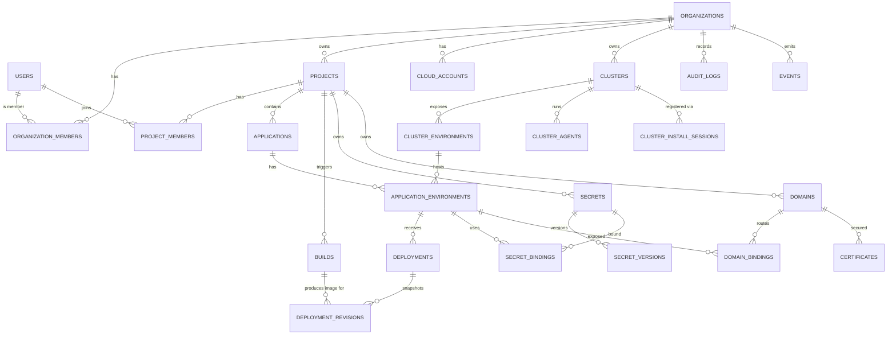

# 05 — Database Design

## 1. Strategy

- **Engine:** PostgreSQL.
- **Tenancy model:** Shared database, shared schema, `org_id` discriminator on every tenant-owned row.
- **Per-service ownership:** each service owns its tables; cross-service reads go through APIs/events, not direct table access.
- **Bulk observability data** (logs/metrics) lives in Loki/Prometheus/object storage, not PostgreSQL — only metadata pointers are stored relationally.

## 2. ER Diagram



## 3. Tables

### Identity & Tenancy
- `users(id, email UNIQUE, name, auth_provider, status, created_at)`
- `organizations(id, name, slug UNIQUE, plan, status, created_at)`
- `organization_members(org_id, user_id, role, status, invited_by, PRIMARY KEY(org_id,user_id))`
- `projects(id, org_id, name, slug, description, created_by, created_at)`
- `project_members(project_id, user_id, role, PRIMARY KEY(project_id,user_id))`
- `invitations(id, org_id, email, role, token_hash, status, expires_at)`
- `quotas(org_id, resource, limit_value, used_value)`

### Cloud & Clusters
- `cloud_accounts(id, org_id, provider, auth_mode, external_account_ref, status)`
- `clusters(id, org_id, provider, name, region, type, status, version, agent_status, created_at)`
- `cluster_environments(id, cluster_id, project_id, environment, namespace)`
- `cluster_install_sessions(id, org_id, cluster_id, token_hash UNIQUE, expires_at, status)`
- `cluster_agents(id, cluster_id, version, last_seen_at, capabilities, status)`
- `cluster_capabilities(cluster_id, capability, value)`

### Applications & Deployments
- `applications(id, org_id, project_id, name, description, owner_id)`
- `application_environments(id, app_id, environment, cluster_env_id, namespace)`
- `deployments(id, org_id, app_env_id, source_type, image, git_ref, status, triggered_by, created_at)`
- `deployment_revisions(id, deployment_id, config_snapshot JSONB, artifact_ref, status, created_at)`
- `rollout_status(deployment_id, ready, total, phase, updated_at)`

### Builds
- `builds(id, org_id, project_id, source_type, source_ref, image_ref, status, created_at)`
- `build_steps(id, build_id, name, status, started_at, finished_at)`
- `build_artifacts(id, build_id, kind, ref)`
- `source_uploads(id, org_id, project_id, object_ref, checksum, created_at)`

### Secrets
- `secrets(id, org_id, project_id, scope, name, encrypted_value_ref, kms_key_ref, current_version)`
- `secret_versions(id, secret_id, version, encrypted_value_ref, created_at)`
- `secret_bindings(id, secret_id, app_env_id, env_var_name)`
- `kms_keys(id, org_id, provider, key_ref, is_customer_managed)`

### Domains & TLS
- `domains(id, org_id, project_id, hostname UNIQUE, status, verification_status)`
- `dns_verifications(id, domain_id, method, record_name, record_value, verified_at)`
- `domain_bindings(id, domain_id, app_env_id, port, tls_enabled)`
- `certificates(id, domain_id, issuer, status, expires_at)`

### Audit & Events
- `audit_logs(id, org_id, actor_id, action, resource_type, resource_id, metadata JSONB, created_at)`
- `events(id, org_id, resource_type, resource_id, event_type, payload JSONB, created_at)`
- `outbox(id, org_id, aggregate_type, aggregate_id, event_type, payload, published_at, created_at)`

## 4. Relationships

- `users` ↔ `organizations` many-to-many via `organization_members`.
- `users` ↔ `projects` many-to-many via `project_members`.
- `organizations` 1→N `projects`, `clusters`, `cloud_accounts`.
- `clusters` 1→N `cluster_environments`; a `cluster_environment` maps a `project` + `environment` to a `namespace`.
- `applications` 1→N `application_environments`; each binds to exactly one `cluster_environment`.
- `application_environments` 1→N `deployments`; each `deployment` 1→N immutable `deployment_revisions`.
- `secrets` 1→N `secret_versions`; `secret_bindings` link a secret to an `application_environment`.
- `domains` 1→N `domain_bindings` and `certificates`.

## 5. Indexes

- All tenant tables: composite PK access `(org_id, id)`; list index `(org_id, created_at)`.
- `organization_members`: unique `(org_id, user_id)`; index `(user_id)`.
- `project_members`: unique `(project_id, user_id)`; index `(user_id)`.
- `clusters`: `(org_id, status)`, `(org_id, provider)`.
- `cluster_agents`: `(cluster_id, last_seen_at)` for staleness scans.
- `cluster_install_sessions`: unique `(token_hash)`, index `(org_id, status, expires_at)`.
- `deployments`: `(app_env_id, created_at DESC)`, `(org_id, status)`.
- `deployment_revisions`: `(deployment_id, created_at DESC)`.
- `builds`: `(org_id, status, created_at)`.
- `secrets`: unique `(project_id, scope, name)`.
- `secret_bindings`: unique `(app_env_id, env_var_name)`.
- `domains`: unique `(hostname)`; index `(org_id, verification_status)`.
- `audit_logs`: `(org_id, created_at DESC)`, `(org_id, actor_id, created_at)`, `(org_id, resource_type, resource_id)`.
- `events`/`outbox`: `(org_id, created_at)`, `(published_at)` partial on unpublished.

## 6. Constraints

- Foreign keys on every parent relationship: `ON DELETE RESTRICT` for tenant roots, `ON DELETE CASCADE` for child detail (e.g., `secret_versions` from `secrets`).
- `NOT NULL` on all `org_id` columns in tenant tables.
- `CHECK` enum constraints: `clusters.status`, `deployments.status`, `builds.status`, `provider IN ('aws','gcp','azure')`, `source_type IN ('git','image','upload')`, `secrets.scope IN ('project','app')`.
- Partial unique index — one active deployment per env: `UNIQUE(app_env_id) WHERE status = 'active'`.
- `secrets` must never have a plaintext column; only `encrypted_value_ref` + `kms_key_ref`.
- `cluster_install_sessions.token_hash` unique; `expires_at` enforced at app layer.
- Immutability: `deployment_revisions` and `audit_logs` are insert-only; a DB trigger blocks `UPDATE`/`DELETE`.

## 7. Partitioning Strategy

- **`audit_logs`:** range partition by `created_at` (monthly); detach/archive old partitions to object storage.
- **`events` / `outbox`:** range partition by `created_at` (monthly); short retention then drop.
- **`deployments` / `deployment_revisions`:** quarterly range partitions once volume is high; standard tables initially.
- **Observability bulk data:** not in PostgreSQL.

## 8. Multi-Tenant Isolation (defense in depth)

1. **Application layer:** authorization middleware injects `org_id` from authenticated context into every query.
2. **Database layer:** PostgreSQL Row-Level Security policies keyed on session variable `app.current_org_id` as a backstop.
3. **Repository guard:** runtime/lint guard rejects queries lacking an org scope.
4. **Noisy-neighbor controls:** per-org quotas, connection pooling per service, gateway rate limits.
5. **Enterprise escalation:** dedicated schema or database per large tenant via a tenant routing table — without changing the data model.
6. **Encryption:** per-org KMS key reference for secrets (customer-managed keys on enterprise tier).

### Example RLS policy (illustrative)
```sql
ALTER TABLE deployments ENABLE ROW LEVEL SECURITY;
CREATE POLICY tenant_isolation ON deployments
  USING (org_id = current_setting('app.current_org_id')::uuid);
```
