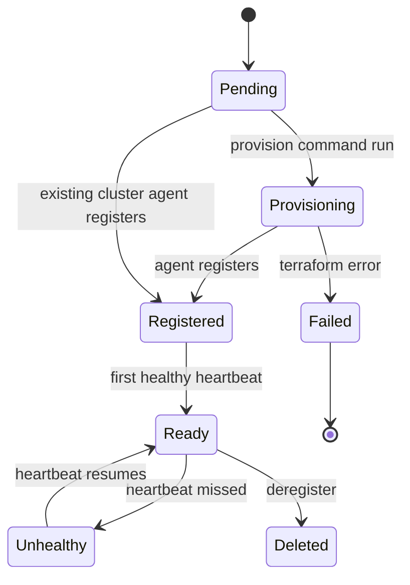

# 07 — Cluster Engine Design

The "cluster engine" covers everything related to onboarding, provisioning, and managing customer Kubernetes clusters across AWS EKS, GCP GKE, and Azure AKS.

## 1. Onboarding Models

### A. Register Existing Cluster
1. Org admin requests registration → Cluster Service creates a cluster record in `pending`.
2. A one-time install token + install command are generated.
3. Admin runs the command (installs the agent Helm chart) against their existing cluster.
4. Agent registers using the one-time token, exchanges it for an agent credential.
5. Cluster transitions `pending → registered → ready` after first healthy heartbeat.

### B. Create New Cluster
1. Org admin submits provider, region, version, node pools, networking.
2. Provisioning Service renders Terraform/OpenTofu variables + backend against versioned modules and produces an install bundle + command.
3. Customer runs the command locally; Terraform provisions cloud infra and the cluster.
4. The bundle installs the agent; the agent registers back as in model A.



## 2. Provisioning Service Internals

- **Template rendering:** maps platform-level inputs to provider-specific Terraform variables using versioned modules in `terraform/modules/{eks,gke,aks}`.
- **Backend config:** supports platform-managed or customer-managed state backend.
- **Install bundle:** generated archive containing rendered tfvars, backend config, agent bootstrap manifest, and the installer CLI invocation. Stored in object storage; referenced by `bundleUrl`.
- **Install session tracking:** `provisioning_runs` records lifecycle, telemetry, and failure diagnostics.
- **Idempotency:** re-running the command reconciles existing infra rather than duplicating it.

## 3. Generated Install Command (conceptual)

The generated command downloads the installer CLI, applies the bundle, runs Terraform/OpenTofu, then installs the agent:

```bash
curl -sSL https://platform.example.com/install/<sessionId> | \
  PLATFORM_INSTALL_TOKEN=<one-time-token> sh
```

The installer CLI (in `agents/installer-cli`) performs: prerequisite checks → `tofu init/plan/apply` → kubeconfig retrieval → agent Helm install → registration callback.

## 4. Cloud-Specific Modules

| Module | Provisions |
|---|---|
| `terraform/modules/eks` | VPC, subnets, IAM roles/OIDC, EKS control plane, managed node groups, addons |
| `terraform/modules/gke` | VPC, subnets, service accounts, GKE cluster, node pools, workload identity |
| `terraform/modules/aks` | VNet, subnets, managed identity, AKS cluster, node pools, RBAC |
| `terraform/modules/networking` | Shared networking primitives |
| `terraform/modules/agent-bootstrap` | Namespace, RBAC, agent install hook |

All modules expose a uniform variable contract (cluster name, region, version, node pools, networking) so the Provisioning Service renders them identically.

## 5. Kubernetes Design — Control Plane Cluster

### Namespaces
- `platform-system` — all control-plane microservices.
- `platform-data` — Postgres operator, Redis, message broker.
- `platform-observability` — Prometheus, Loki, Grafana, Alertmanager.
- `platform-ingress` — ingress controller, cert-manager.

### RBAC
- Each service runs under a dedicated ServiceAccount with least-privilege Roles. No service has cluster-admin.

### Ingress + TLS
- Single hardened external surface: the API Gateway behind a cloud LB + ingress controller.
- cert-manager with ACME ClusterIssuer for platform TLS.

### Monitoring Stack
- Prometheus (metrics), Loki (logs), Grafana (dashboards), Alertmanager → Notification Service.
- OpenTelemetry collector for distributed tracing across services.
- SLO dashboards: gateway latency, deployment success rate, heartbeat freshness, ingest throughput.

## 6. Kubernetes Design — Customer Cluster

### Namespaces
- `platform-agent` — agent + controllers.
- `proj-{slug}-{env}` — one workload namespace per project/environment, managed by the agent.

### RBAC
- Agent uses a ClusterRole scoped to `proj-*` namespaces: manage Deployments, Services, Secrets, Ingress, HPA. No access to `kube-system` or unrelated resources. Leader-election RBAC for HA.

### CRDs (owned by the agent)
- `PlatformApplication` — desired app spec mirror.
- `PlatformDeployment` — revision-pinned rollout intent.
- `PlatformSecretSync` — scoped secret sync instruction.
- `PlatformDomain` — ingress/TLS binding intent.

Each CRD has a `status` subresource the agent updates and reports back to the control plane.

### Ingress + cert-manager
- The agent configures Ingress resources per `domain_binding`.
- cert-manager (ACME ClusterIssuer) issues TLS certificates; renewal monitored, with `CertificateExpiring` emitted before expiry.

## 7. Cluster Health & Heartbeats

- Agent sends periodic heartbeats with status, node count, version, and timestamp.
- Cluster Service buffers heartbeats (Redis) before DB flush to handle write volume.
- Missed heartbeats beyond a threshold flip the cluster to `Unhealthy` and emit `ClusterUnhealthy` (→ Notification, Observability).
- The heartbeat response can carry `desiredAgentVersion` to trigger self-update.

## 8. Capacity & Assignment

- `cluster_environments` maps a `(project, environment)` to a `namespace` on a cluster.
- Assignment requires the cluster to be `ready`.
- Deployments target a `cluster_environment`; the Deployment Service computes desired state and the agent reconciles it.
