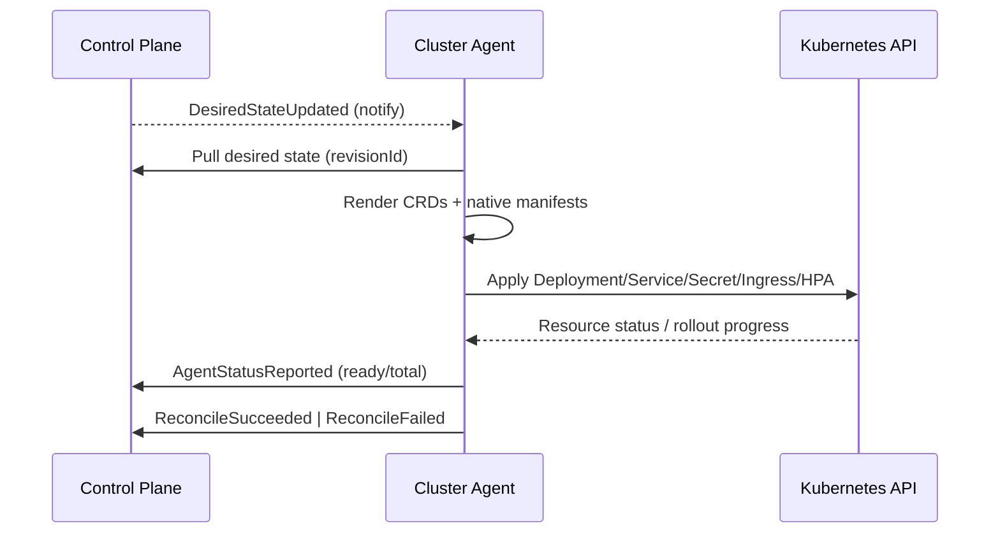
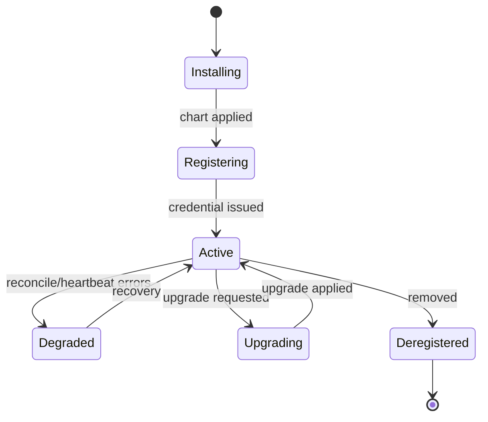

# 08 — Cluster Agent Design

The cluster agent runs inside each customer Kubernetes cluster (data plane). It is the only component that bridges the control plane and customer workloads, and it connects **outbound only**.

## 1. Responsibilities

- Register with the control plane using a one-time install token and obtain a per-cluster credential.
- Send periodic heartbeats with health and capability data.
- Pull desired state (deployments, secret syncs, ingress/domain configs) and reconcile it to native Kubernetes resources.
- Report actual state (rollout progress, reconcile success/failure) back to the control plane.
- Ship pod logs and metrics metadata to the Observability Service.
- Self-update when the control plane requests a new version.

## 2. Components

| Component | Role |
|---|---|
| Registration controller | One-time token exchange, credential storage (in-cluster Secret) |
| Heartbeat reporter | Periodic status + capability reporting |
| Sync/reconcile loop | Pull desired state, apply CRDs, reconcile native resources |
| CRD controllers | Reconcile `PlatformApplication`, `PlatformDeployment`, `PlatformSecretSync`, `PlatformDomain` |
| Log shipper | Stream pod logs to Observability ingest |
| Metrics collector | Scrape/forward metrics metadata |
| Updater | Apply control-plane-requested agent upgrades |

## 3. Connectivity Model

- Outbound HTTPS/gRPC only to the control plane; no inbound ports opened on the customer cluster.
- Long-poll or streaming pull for desired-state changes (`DesiredStateUpdated` notifications trigger an immediate pull; otherwise periodic reconcile).
- All requests carry the per-cluster agent credential (mTLS or signed bearer).

## 4. CRDs

```text
PlatformApplication   # desired app spec mirror
PlatformDeployment    # revision-pinned rollout intent
PlatformSecretSync    # scoped secret sync instruction
PlatformDomain        # ingress/TLS binding intent
```

Each has a `status` subresource updated by the agent and surfaced back to the control plane via `AgentStatusReported`.

## 5. Reconcile Flow



## 6. Secret Sync

1. Control plane emits `SecretSyncRequested` with scoped `secretRefs` for a `clusterEnvId`.
2. Agent fetches encrypted material over its authenticated channel (decryption boundary per platform policy).
3. Agent writes a native Kubernetes `Secret` into the target namespace only.
4. Agent reports sync status; access metadata audited centrally. Plaintext is never logged.

## 7. Ingress & TLS

- Agent reconciles `PlatformDomain` into native `Ingress` resources per `domain_binding`.
- cert-manager (ACME ClusterIssuer) issues/renews TLS certificates.
- Certificate status reported back; `CertificateExpiring` handled centrally for notifications.

## 8. Logs & Metrics

- **Logs:** stream pod logs in batches to the Observability ingest endpoint; backpressure-aware; `LogBatchShipped` recorded.
- **Metrics:** forward metrics metadata / remote-write to the platform metrics backend; bulk data stays out of PostgreSQL.

## 9. High Availability

- Deployed as a 2-replica Deployment with leader election; only the leader reconciles.
- Reconcile queue is bounded with backpressure to protect the cluster.
- Resource requests/limits set conservatively; runs in the `platform-agent` namespace.

## 10. RBAC (in customer cluster)

- ClusterRole scoped to `proj-*` namespaces: manage Deployments, Services, Secrets, Ingress, HPA, Pods (read/logs).
- No access to `kube-system` or unrelated tenant resources.
- Leader-election RBAC (Leases) in `platform-agent`.

## 11. Security

- Per-cluster credential, rotatable and revocable from the control plane; revocation effective immediately.
- Agent upgrades are signed and version-pinned by the control plane (`AgentUpgradeRequested`).
- No inbound exposure; least-privilege RBAC; secrets written only to target namespaces.

## 12. Failure Handling

| Failure | Behavior |
|---|---|
| Control plane unreachable | Retry with backoff; continue serving current desired state |
| Reconcile error | Emit `ReconcileFailed`, retry with backoff, surface in CRD status |
| Credential revoked | Stop reconciling, attempt re-registration if a valid session exists |
| Heartbeat missed | Control plane marks cluster `Unhealthy`; agent resumes on recovery |
| Upgrade failure | Roll back to previous agent version; report status |

## 13. Lifecycle States


